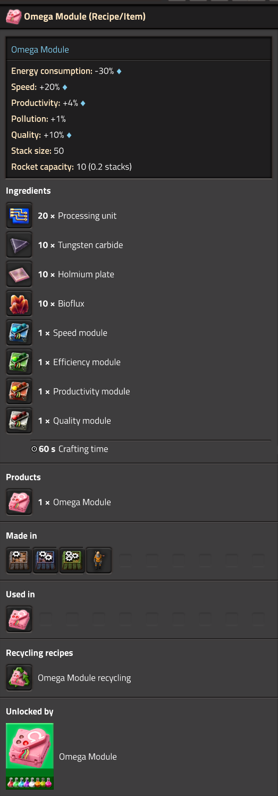
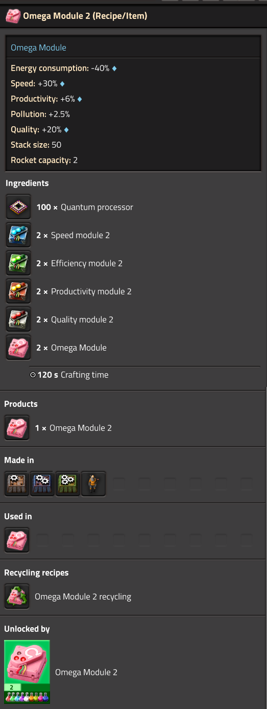
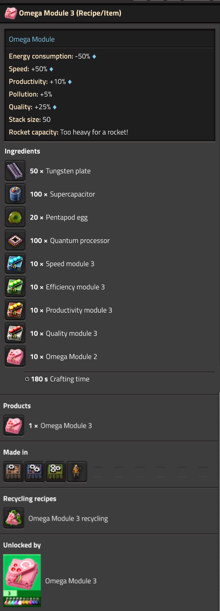

# Omega Module

> [!WARNING]
> ## Factorio 2.1 Experimental Version
>
> This branch is intended **only for Factorio 2.1 Experimental**.
>
> For Factorio 2.0, use the `main` branch.
>
> This version may change as Factorio 2.1 develops and is not considered stable.

This mod adds an endgame Omega Module that combines the effects of Speed, Efficiency, Productivity and Quality modules into a single module item.

## Notes
- Each tier adds the effects of the other four modules
- Easy mode can be toogled in the settings under Startup. This makes the recipe to create these modules only require other modules, not other resources
- There is a hefty polution penalty when using these 10%/25%/50% for tier 1-3 respectivly
- You can turn off the polution penalty in settings
- Omega Module 1 requires the discovery of Vulcanus, Gleba, Fulgora and the research of all other tier 1 modules
- Omega Module 2 requires the discovery of Aquilo and the research of all other tier 2 modules
- Omega Module 3 requires the research of captivity, promethium science packs and all other tier 3 modules
- Since Factorio calculates weight based on different factors that can't be controlled by mods, these are some heavy modules
- You can transport tier 1 and 2 with space ship, but tier 3 is to heavy
- If you turn on easy recipes you can transport all modules by space ship
- You can toggle which effects the omega module has in settings
- You can multiply the cost of the modules research cost (range is 0-10 where 0 is half the cost of default)

## Screenshots

  
  
  

## Installation
1. Use the ingame mod browser
2. Search for Omega Module
3. Click install

License: MIT
